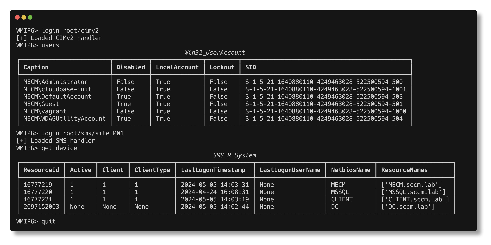

<p align=center>
  <br>
  <span>WMI Play Ground</span>
  <br>
  
</p>

# Installation

* pipx

```bash
pipx install git+https://github.com/Veids/wmipg.git
```

* poetry

```bash
git clone https://github.com/Veids/wmipg.git 
cd wmipg
poetry install
poetry shell
```

# Functionality

## root/cimv2

* env - Print environment variables
* loggedon - Enumerated currently logged-on users
* logon_history - Print users logon history information
* ls - List directory content
* ping - Get ping result of a remote system
* profiles - List local user profiles
* pslist - Get process list
* reg - StdRegProv operations
    * enum - Enumerate juicy registry content (WinSCP)
    * query - Query registry
* service - Interact with services
    * list - Enumerate services
* shadow - Interact with shadow copies
    * create - Create a shadow copy
    * delete - Remove a shadow copy
    * list - Enumerate shadow copies
* shares - List windows shares
* stat - Get info about particular file
* users - Get local users list (net user)
* volumes - Get volumes list

## root/standardcimv2

* netstat - Get connections info
* ipconfig - Get interface list along with assigned IP address

## root/securitycenter2

* get_av - Enumerate antivirus software deployed on the system

## root/SMS/site_{CODE} (SCCM)

* get
    * application - Retrives application object (SMS_Application)
    * application-xml - Retrives application XML
    * collection - Retrives collection object (SMS_Collection)
    * collection-members - Get collection members
    * deployment - Get deployment object (SMS_ApplicationAssignment)
    * device - Query a device
    * operation-status
    * primary-device - Query a device matching a user
    * script - get a script info
    * scripts - get scripts info (lazy)
    * scripts-execution-summary
    * site-push-settings - Get various information about SCCM
* add
    * application - Create an application
    * collection - Add SYSTEM or USER collection
    * collection-membership-rule - Add a rule for devices to include into collection
    * deployment - Create a deployment
    * script - Create a script
* del
    * application - Set application expired state and remove
    * collection - Remove a collection
    * collection-membership-rule - Remove a rule from collection
    * deployment - Remove a deployment
    * operation - Remove an operation
* update
    * machine-policy - Force a device to update a machine policy from SCCM
    * script-approval - Approve a script

# Credits

* [SharpSCCM](https://github.com/Mayyhem/SharpSCCM)
* [impacket](https://github.com/fortra/impacket)
